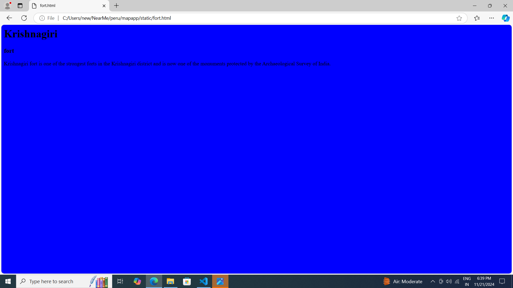

# Ex04 Places Around Me
## Date: 21/11/2024

## AIM
To develop a website to display details about the places around my house.

## DESIGN STEPS

### STEP 1
Create a Django admin interface.

### STEP 2
Download your city map from Google.

### STEP 3
Using ```<map>``` tag name the map.

### STEP 4
Create clickable regions in the image using ```<area>``` tag.

### STEP 5
Write HTML programs for all the regions identified.

### STEP 6
Execute the programs and publish them.

## CODE
```
<html>
    <body>
     <h1> Krishnagiri </h1>
     <h3> Pooja P(24900963) </h3>

<map name="image-map">
    <area target="" alt="Krishnagiri fort" title="Krishnagiri fort" href="fort.html" coords="758,172,903,230" shape="rect">
    <area target="" alt="Krishnagiri court" title="Krishnagiri court" href="court.html" coords="370,507,42" shape="circle">
    <area target="" alt="Arts college" title="Arts college" href="arts.html" coords="418,399,43" shape="circle">
    <area target="" alt="Poorvika mobiles" title="Poorvika mobiles" href="mobiles.html" coords="657,369,802,419" shape="rect">
    <area target="" alt="Hotel velan" title="Hotel velan" href="hotel.html" coords="1108,702,1209,710,1186,749,1110,742" shape="poly">
</map>
  </body>
 </html>

 fort.html
 <html>
    <body bgcolor="blue">
        <h1> Krishnagiri</h1>
        <h3> fort</h3>
    <p>
        Krishnagiri fort is one of the strongest forts in the Krishnagiri district and is now one of the 
        monuments protected by the Archaeological Survey of India.
        
      </p>
    </body>
    </html>

    court.html
    <html>
    <body bgcolor="red">
    <h1> Krishnagiri</h1>
    <h3> court</h3>
    <p>
         District court in Krishnagiri courts, Krishnagiri listed under 
        Government Organisations in Krishnagiri.
        
    </p>
    </body>
  </html>

  arts.html
  <html>
    <body bgcolor="pink">
        <h1> Krishnagiri </h1>
        <h3> arts</h3>
        <p>
         Government Arts college for women was established in the 
         year 1992.
         
        </p> 
      </body>
   </html>

   hotel.html
   <html>
    <body bgcolor="green">
        <h1> Krishmagiri</h1>
        <h3> hotel</h3>
    <p>
     The Hotel Velan International is situated in very congested area.
    </p>
  </body>
</html>

 mobiles.html
 <html>
    <body bgcolor="green">
 <h1> Krishnagiri</h1>
 <h3> mobiles</h3>
<p>
     Krishnagiri is a top player in the category mobile phone dealers in the Krishnagiri.
</p>
</body>
</html>
    
```   


## OUTPUT
.png>)



## RESULT
The program for implementing image maps using HTML is executed successfully.
